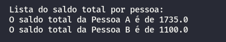
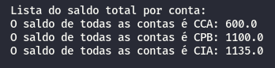
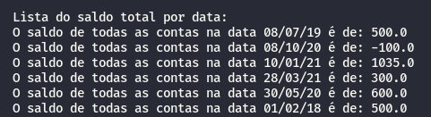

# Consulta Bancaria
A consulta bancária é um script que irá pegar as informações de um arquivo de planilha relacionado a contas e registros bancários e irá mostrar:

<ul>
<li>O saldo total por pessoa;</li>
  
<li>O saldo total por conta;</li>
  
<li>O total de todas as contas por data.</li>
  
</ul>


# Regras

<ul>
  <li>Todas as informações serão exibidas no console;</li>
  <li>Um registro sem conta e/ou sem valor será ignorado;</li>
<li>Todas as ocorrências acima serão registradas em um txt. O txt terá o número da linha que está com problema.</li>
</ul>

# Depedências

* [python3](https://www.python.org/)
* [pip](https://pip.pypa.io/en/stable/installing/)

# Como rodar o projeto

Abra o terminal e rode os seguintes comandos:
```
$ git clone https://github.com/andersonh-santos/ConsultaBancaria.git
$ cd ConsultaBancaria
$ pip install -r requirements.txt
$ python3 main.py
```
